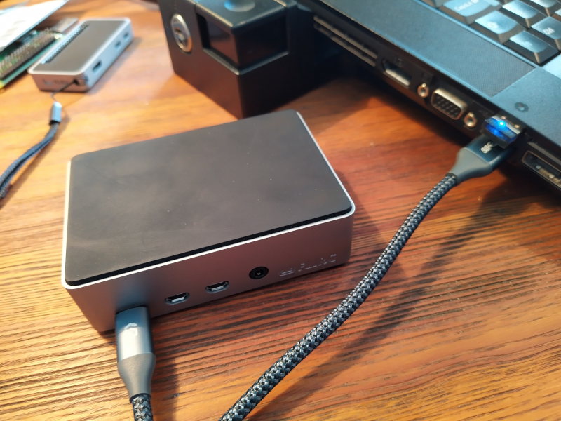
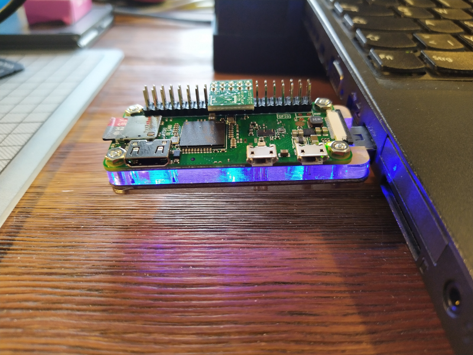

<!---<p align="center">
  <a href="https://www.dyne.org">
    
  </a>
</p>--->

<h1 align="center">
  Devuan Pi Gadgeteer</br>
  <sub></sub>
</h1>

<p align="center">
  Give power to a Pi</br>
  Get virtual USB devices
</p>





<p align="center">
  <a href="https://dyne.org">
    
  </a>
</p>

<br><br>

<h4 align="center">
  <a href="#-prepare">📝 Prepare</a>
  <span> • </span>
  <a href="#-install">💾 Install</a>
  <span> • </span>
  <a href="#-quick-start">🎮 Quick start</a>
  <span> • </span>
  <a href="#-links">🌐 Links</a>
  <span> • </span>
  <a href="#-contributing">👤 Contributing</a>
  <span> • </span>
  <a href="#-license">💼 License</a>
</h4>


**Work in progress** 🚧: 

Devuan Pi Gadgeteer is an ansible script to enable compatible Raspberry Pi hardware models running [Devuan Pi](https://arm-files.devuan.org/RaspberryPi%20Latest%20Builds/) to act as a multi-function USB device (also called a gadget) when connected to a host or laptop.

The default configuration offers a USB network interface presented to the USB host with a higher routing priority than other native ethernet or WiFi interfaces. This means all default networking traffic is configured to flow through the Devuan Pi USB gadget.

The default configuration also offers a virtual USB flash drive storage device (capacity configurable, default 10G), a side effect of this is the connected USB host can potentially be booted from this device.

This repository should be cloned on a local provisioning machine, not on the device to be provisioned (this may work, but has not been tested).

Currently the script enables a compatible Devuan Pi to present itself to a USB host as:

- a USB 10G mass storage gadget (capacity is configurable)

- network adapter gadgets (ECM & RNDIS adapters)

(more coming soon)

** Raspberry Pi Hardware Compatibility **

This script installs the dwc2 Device Tree overlay module, which is functional and tested on:


| Pi Model             |    |
| :------------------- |:--:|
| Raspberry Pi 4       |Yes |
| Raspberry Pi Zero W  |Yes |
| Raspberry Pi Zero 2 W|Yes |
| Raspberry Pi 1       | No |
| Raspberry Pi 2       | No |
| Raspberry Pi 3       | No |


This script is known not to work on the following models (as hardware/internal wiring is incompatible).


USB Host functionality has been tested as functional on:

- Windows 10 (Thinkpad P52)
- Fedora 35 Linux (Thinkpad P52)
- macOS Monterey (MacBook Air M1 2020)
- Android 11 (Nokia 7.2) (under voltage warnings: no networking but mass storage works)

| Host OS        | Host Hardware        | Pi Model | USB Storage |USB Network|
| :------------- |:-------------------- |:--------:|:----------: |:---------:|
| Windows 10     | Lenovo Thinkpad P52  | Pi 4     |    Yes      |   Yes     |
| macOS Monterey | MacBook Air M1 2020  | Pi 4     |    Yes      |   Yes     |
| Android 11     | Nokia 7.2            | Pi 4     |    Yes      |   No      |

</br>

<details id="toc">
 <summary><strong>🚩 Table of Contents</strong> (click to expand)</summary>

* [Prepare](#-prepare)
* [Install](#-install)
* [Quick start](#-quick-start)
* [Links](#-links)
* [Contributing](#-contributing)
* [License](#-license)
</details>

##  📝 Prepare

- Install Devuan Pi on a compatible Raspberry Pi from latest nightly builds for Devuan Pi, available on the [Devuan ARM images site](https://arm-files.devuan.org/RaspberryPi%20Latest%20Builds/). Download & install the correct image for your hardware (Devuan Daedalus release recommended).

- Configure the freshly installed Devuan Pi with a wireless network (as root):

```

menu-config

```
***

_When the device is connected to the wireless network, take note of its IP address as it may be needed for if multicast DNS is not detected during the install process._

***
## 💾 Install

Once the Devuan Pi is connected to the local network, issuing the following on the provisioning host to start the install:

```

make play

```
This executes an ansible playbook to configure the system and will reboot the Pi.

On the first reboot, the system will then format a fresh 10G (default) image file for a USB mass storage device. This can take about 20 minutes on a Pi 4.

***

_By default, the Devuan Pi hostname is configured as `devuanpi`. If on the provisioning host, the ansible script errors reporting it cannot find the target device, edit the file `hosts.yml` and replace the hostname `devuanpi.local` with the IP address of the Pi to be provisioned._

***

## 🎮 Quick start

- Power down the provisioned Pi and disconnect the Pi power supply.

- Connect a USB cable to the the Pi USB power supply USB port.

- Connect the other end of the USB cable to a host computer.

***

_With power now supplied by the host computer, in exchange, the Devuan Pi will boot and expose USB storage and network devices to the host._

***
**[🔝 back to top](#toc)**


## 😍 Acknowledgements

[](http://www.dyne.org)

Copyleft (ɔ) 2022 by [Dyne.org](https://www.dyne.org) foundation, Amsterdam

Designed, written and maintained by Adam Burns.

**[🔝 back to top](#toc)**

***
## 🌐 Links


**[🔝 back to top](#toc)**

***
## 👤 Contributing

Please first take a look at the [Dyne.org - Contributor License Agreement](CONTRIBUTING.md) then

1.  🔀 [FORK IT](../../fork)
2.  Create your feature branch `git checkout -b feature/branch`
3.  Commit your changes `git commit -am 'Add some fooBar'`
4.  Push to the branch `git push origin feature/branch`
5.  Create a new Pull Request
6.  🙏 Thank you


**[🔝 back to top](#toc)**

***
## 💼 License
    Devuan Pi Gadgeteer - 
    Copyleft (ɔ) 2021 Dyne.org foundation, Amsterdam

    This program is free software: you can redistribute it and/or modify
    it under the terms of the GNU Affero General Public License as
    published by the Free Software Foundation, either version 3 of the
    License, or (at your option) any later version.

    This program is distributed in the hope that it will be useful,
    but WITHOUT ANY WARRANTY; without even the implied warranty of
    MERCHANTABILITY or FITNESS FOR A PARTICULAR PURPOSE.  See the
    GNU Affero General Public License for more details.

    You should have received a copy of the GNU Affero General Public License
    along with this program.  If not, see <http://www.gnu.org/licenses/>.

**[🔝 back to top](#toc)**
